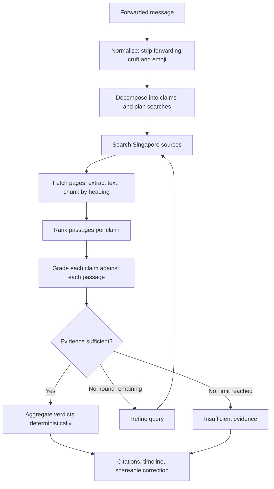

# ForwardCheck

Paste a forwarded message. Get a separate, evidence-backed verdict for every claim in it.


## Overview

ForwardCheck is a claim-level verification assistant for Singapore-focused forwarded
messages — the kind that circulate in WhatsApp and Telegram groups about government
policies, fines, deadlines, eligibility rules, public advisories, product and food
recalls, and transport or community announcements. It decomposes a message into
independently checkable claims, retrieves evidence from authoritative sources, and
returns a verdict, an explanation and a citation for each claim.

The design premise is that these messages are rarely fabricated outright. They
usually start from something real — an actual policy, an actual recall — and then
overstate it. A maximum penalty becomes automatic. One recalled batch becomes every
bottle. A benefit per household becomes one per person. A deadline two years away
becomes next week.

A single true-or-false answer cannot express that. Worse, answering "false" to a
message that is half correct hands anyone who knows the true half a reason to
dismiss the correction entirely. ForwardCheck gives each claim its own verdict, so
the accurate parts stay accurate and only the overstated parts are flagged.

It verifies **factual claims**, not sender intent. It is not a scam or phishing
detector.

## Why not just use a general web-search assistant?

| General web-search assistant | ForwardCheck |
|---|---|
| You formulate the question | You paste the message unchanged |
| Usually answers at message level | Separates and verifies each claim independently |
| General source selection | Weights official Singapore sources above news, news above secondary |
| May smooth over subtle exaggeration | Explicitly checks status, scope, modality, dates and amounts |
| Conversational answer | Structured verdicts with evidence mapped per claim |
| One search pass | Re-searches per claim when evidence is insufficient or conflicting |

## Two modes

| | Demo mode (default) | Live mode |
|---|---|---|
| Evidence | 38 seeded sample documents | Live web search and page fetching |
| Claim decomposition | Deterministic rules | Anthropic, structured output (rule-based fallback) |
| Grading | Deterministic rule cascade | Anthropic, one batched call per round |
| Verdict aggregation | Deterministic | Deterministic (same rules) |
| API keys | None | `ANTHROPIC_API_KEY` + `TAVILY_API_KEY` |
| Cost | None | Bounded per request — see [Cost controls](#cost-controls) |

Demo mode is the default, makes no network calls, and is what every test runs. It
is a genuine deterministic baseline, not a stub. Live mode is opt-in via
`FORWARDCHECK_MODE=live`.

In **both** modes the verdict is decided by deterministic Python. In live mode the
model's role is bounded: extract claims, plan queries, and judge each
(claim, evidence) pair. Aggregation into the five labels, the citation requirement
and confidence scoring never depend on free-form generation.

## Example

Real output from a live run against the message below. Sources are genuine URLs the
pipeline retrieved and read.

> From 1 Sept, HDB cat owners with more than 2 cats will automatically be fined
> $5,000 and AVS will remove the extra cats. All cats, including community cats,
> must be licensed by 31 Aug. Forward to all cat owners.

**Overall: Misleading** (confidence 0.58, 19 evidence passages)

| Extracted claim | Verdict | Key reason | Source |
|---|---|---|---|
| Owners with more than 2 cats will automatically be fined $5,000 | **Misleading** | Source says fines of *up to* $5,000 for non-compliance with licensing conditions — conditional, not automatic | [straitstimes.com](https://www.straitstimes.com/singapore/community/cat-licensing-scheme-to-kick-in-on-sept-1-in-singapore) (full page) |
| AVS will remove the extra cats | **Insufficient evidence** | Retrieved sources touch the topic but none confirm this | — |
| Cats must be licensed by 31 Aug | **Misleading** | Official source states the deadline is 31 August **2026**, the end of a transition period — not the imminent date the message implies | [nparks.gov.sg](https://www.nparks.gov.sg/news/news-detail/cat-owners-reminded-to-license-their-cats-by-31-august-2026-as-transition-period-for-pet-cat-licensing-comes-to-an-end) (snippet) |
| Community cats must be licensed by 31 Aug | **False** | Source scopes the requirement to *pet* cats; community cats are managed separately | [nparks.gov.sg](https://www.nparks.gov.sg/news/news-detail/cat-owners-reminded-to-license-their-cats-by-31-august-2026-as-transition-period-for-pet-cat-licensing-comes-to-an-end) (snippet) |

Note the third row: the seeded demo corpus contains no 2026 date, so this
distinction came from live retrieval alone. The `AVS will remove the extra cats`
row is the system declining to answer rather than guessing.

Demo mode runs the same message against seeded sample evidence. Those documents are
clearly labelled and use placeholder URLs, which the UI deliberately renders as
plain text so a sample can never be mistaken for a real citation.

## How it works



1. **Normalise** — strips forwarding appeals, emoji and urgency banners. What was
   removed is recorded, since "this message told you to forward it" is itself a signal.
2. **Decompose and plan** — one structured call returns atomic claims with their
   entities, organisations, dates, amounts, status type and jurisdiction, *plus*
   one or two targeted queries each. Combining both halves the request cost.
3. **Search** — queries prefer official domains via `site:` operators, with an
   unrestricted Singapore-scoped query as backup.
4. **Fetch and chunk** — top results are fetched, boilerplate stripped, text split
   on heading and paragraph boundaries with full provenance attached.
5. **Rank** — per claim, by lexical relevance multiplied by exact anchor matches,
   source tier and freshness.
6. **Grade** — all (claim, passage) pairs in one structured call.
7. **Decide or refine** — sufficient evidence ends the loop; insufficient,
   conflicting or outdated-only evidence earns one more round.
8. **Aggregate** — deterministic rules produce verdicts, confidence, the status
   timeline and the shareable correction.

## Claim decomposition vs document chunking

Two different operations, easy to conflate:

- **Claim decomposition** splits the *user's forwarded message* into independently
  verifiable assertions. Semantic; done by the LLM in live mode, by rules in demo
  mode. Every claim must quote a span of the original message — claims whose span
  is not traceable to the message are discarded as hallucinated extractions.
- **Document chunking** splits a *retrieved source page* into gradeable passages.
  Structural and fully deterministic: heading-aware, paragraph-preserving, with
  configurable size and overlap so a fact straddling a boundary appears whole in at
  least one chunk. Every chunk carries source URL, title, publisher, tier,
  publication date, retrieval timestamp, jurisdiction, originating query, heading,
  and whether it came from a full page or a search snippet.

## Verdict framework

| Verdict | Meaning |
|---|---|
| `Supported` | Evidence backs the claim as stated |
| `Misleading` | Partly true, but status, scope, modality or timing is overstated |
| `False` | Evidence directly contradicts the claim |
| `Outdated` | Supported only by evidence the grader marked as superseded |
| `Insufficient evidence` | No retrieved source answers the claim either way |

The distinctions that matter most in practice:

- **Maximum vs automatic** — "liable on conviction to a fine up to $5,000" does not
  support "you will automatically be fined $5,000"
- **Some vs everyone** — one recalled batch is not every product; a household
  benefit is not a per-person one; pet cats are not all cats
- **Proposed vs passed vs effective vs enforced** — a law passing in Parliament does
  not mean it is in force, and being in force does not mean penalties have started
- **Overseas vs Singapore** — a recall in another market is not a local recall
- **Once true vs currently true** — a real announcement that has since been
  superseded is `Outdated`, not `Supported`

## Retrieval and evidence pipeline

**Retrieval is lexical and heuristic — not semantic, and not hybrid.** No embeddings
are generated anywhere in this repository, and no vector database is used.

**Query generation.** In live mode the LLM plans one or two queries per claim in the
same call that extracts it, preserving exact organisation names, amounts, dates,
product names and status terms. Official domains are targeted with `site:` operators
first, with an unrestricted Singapore-scoped query as fallback.

**Search provider.** Tavily, behind a `SearchAdapter` interface. Each result is
normalised to title, canonical URL, publisher, snippet, publication date when
available, provider relevance score, and the query that produced it.

**Source authority** is determined by a domain allowlist mapping Singapore
government and statutory-board domains, Singapore Statutes Online and the courts,
and established Singapore newsrooms to four tiers with fixed weights:

| Tier | Weight | Examples |
|---|---|---|
| `primary` | 1.00 | Singapore Statutes Online, judiciary.gov.sg |
| `official` | 0.90 | gov.sg, nparks.gov.sg, hsa.gov.sg, sfa.gov.sg, mom.gov.sg, police.gov.sg |
| `credible_news` | 0.65 | CNA, The Straits Times, TODAY, Mothership, Mediacorp |
| `secondary` | 0.30 | everything else |

This is deterministic code, not a prompt instruction. Domains outside the allowlist
are kept but weighted as `secondary` — a developing event sometimes only has
secondary coverage — and can never outrank an official source on authority alone.

**Fetching is treated as untrusted input**, because URLs arrive from an external
provider. Only `http`/`https`; every hostname is resolved and rejected if it maps to
private, loopback, link-local, multicast or reserved space; redirects are
re-validated at each hop, since a redirect into internal space is a standard SSRF
pivot; response size, timeout, redirect count and content type are all capped. Login
walls and paywalls are not bypassed.

**Extraction** is a dependency-free HTML-to-text pass that skips
nav/header/footer/aside/script/form and preserves headings as structural markers. It
is not a readability engine; Singapore government advisory pages are structurally
simple, which is what makes this adequate. When a fetch fails, the search snippet is
retained as **explicitly weaker evidence**, scored down and labelled in the UI.

**Ranking** combines token overlap with boosts for exact amount, entity and date
matches, then multiplies by tier weight and a freshness factor. Snippet-only
evidence is discounted. Passages with near-zero lexical relevance are dropped
entirely — **authority multiplies relevance, it never substitutes for it**, so an
irrelevant official page cannot displace a relevant one. Materially duplicate
passages are removed by content fingerprint, and each claim keeps at most
`FORWARDCHECK_MAX_SOURCES_PER_CLAIM` passages.

**Citation mapping.** Every grade names a specific (claim, evidence) pair. Grades
naming a pair the pipeline never created are discarded, so the model cannot invent
citations. Each evidence card lists which claims it supports and which it refutes.

**Why live retrieval rather than a prebuilt index.** Policies, advisories, recalls
and deadlines change. A static index answers with whatever was true when it was
built — which for this problem is the failure mode itself, since a forwarded message
is often a real announcement that has since been superseded. The live run above
found a 2026 deadline that no seeded document contained.

## Bounded conditional retrieval

The pipeline decides whether to search again, and records why. A claim earns a
second round when:

- **no qualifying evidence** — nothing graded above the confidence floor
- **sources conflict** — qualifying evidence both supports and refutes it
- **evidence appears outdated** — every qualifying passage is marked superseded

On a second round the LLM's refined query for that claim is used, or a fallback
query built from the claim text. Every extra round is written to the trace with its
reason, and surfaced in the developer panel.

The loop is bounded: at most `FORWARDCHECK_MAX_SEARCH_ROUNDS` (default 2) per claim,
under a total search and fetch budget for the request. It stops immediately once
evidence is adequate — it does not always run to the limit. When limits are reached
with evidence still insufficient, the claim abstains rather than guessing. This
bounds both latency and spend.

## Source quality and abstention

Silence is never read as agreement. A passage that does not address a claim is
graded `does_not_answer` and contributes nothing — absence of information is not
contradiction. A claim with no qualifying evidence returns `Insufficient evidence`.

Every non-abstaining verdict must cite at least one evidence ID; this is asserted in
tests. Confidence combines evidence agreement, source tier and retrieval strength —
the model's self-reported confidence is one input, never the whole score.

Abstention is a first-class outcome, not a failure path. In the worked example
above, one of four claims abstained.

## Cost controls

Live mode spends money, so limits are enforced in code. Every provider call charges
a per-request meter *before* it is made; exceeding a limit degrades to abstention
rather than raising.

| Limit | Default | Variable |
|---|---|---|
| Claims per message | 6 | `FORWARDCHECK_MAX_CLAIMS` |
| LLM calls per request | 3 | `FORWARDCHECK_MAX_LLM_CALLS_PER_REQUEST` |
| Search rounds per claim | 2 | `FORWARDCHECK_MAX_SEARCH_ROUNDS` |
| Searches per request | 8 | `FORWARDCHECK_MAX_SEARCHES_TOTAL` |
| Page fetches per request | 8 | `FORWARDCHECK_MAX_FETCHES_TOTAL` |
| Sources per claim | 3 | `FORWARDCHECK_MAX_SOURCES_PER_CLAIM` |
| Request timeout (s) | 20 | `FORWARDCHECK_REQUEST_TIMEOUT_SECONDS` |

Limits are validated at startup — an out-of-range value raises rather than being
silently clamped.

Also:

- **Nothing runs on page load**, and loading an example makes no request.
  Verification happens only on explicit submit; double submission is blocked.
- **Batched calls** — decomposition and query planning share one call; all pairs in
  a round are graded in one call.
- **TTL caches** for searches, fetched pages and whole verification results, keyed
  by provider, query and parameters. Authentication errors and malformed responses
  are never cached.
- **Retry policy** — exactly one bounded retry with backoff for transient 429/5xx.
  Authentication, permission and quota errors are never retried.
- **No paid calls from tests.** `app/tests/conftest.py` forces demo mode and strips
  provider keys at collection time, so `pytest` cannot spend money even when `.env`
  is configured for live mode. The only paid path is an opt-in script.
- **Usage is reported, not estimated** — LLM calls, searches, fetches, cache hits,
  mode and token counts appear in the developer panel. No dollar figures are shown,
  since that would require pricing this repository does not verify.

## Architecture

| Layer | Responsibility | Implementation |
|---|---|---|
| Frontend | Submission, verdicts, evidence display | Next.js 16, React 19, TypeScript, Tailwind v4 |
| Backend API | Routing, validation, rate limiting, error mapping | FastAPI, Pydantic v2 |
| Claim analysis | Structured decomposition and query planning | Anthropic (live) / deterministic rules (demo) |
| Retrieval | Search, fetch, extract, chunk, rank | Tavily + httpx + stdlib parser; lexical ranking |
| Evidence grading | Claim–passage relationships | Anthropic, batched, Pydantic-validated (live) / rule cascade (demo) |
| Verdict engine | Aggregation, confidence, timeline, correction | **Deterministic Python in both modes** |
| Cache | Reuse of searches, pages, results | File-based TTL cache |

The split is deliberate: the LLM produces *evidence relationships*, and code
produces *verdicts*. Anything a user acts on is computed by rules that can be
tested, not generated as prose.

## Tech stack

| Layer | Technology |
|---|---|
| Frontend | Next.js 16 (App Router), React 19, TypeScript, Tailwind CSS v4 |
| Backend | FastAPI, Pydantic v2, Python 3.13, Uvicorn |
| LLM | Anthropic Messages API via the official `anthropic` SDK, structured outputs validated with Pydantic |
| Search | Tavily Search API via `httpx` |
| Fetching | `httpx` + stdlib `HTMLParser`, with SSRF and size/timeout guards |
| Retrieval | BM25 (implemented in-repo) for the seeded corpus; lexical + heuristic ranking for live passages |
| Cache | File-based TTL cache under `backend/.cache/` |
| Testing | pytest, all offline |

No vector database, no embedding model, no orchestration framework. The pipeline
graph is a small custom state runner.

## Project structure

```
backend/
  app/
    main.py                FastAPI: /verify, /health, /config; rate limiting,
                           startup validation, safe error mapping
    config.py              Mode switch, budgets, TTLs, .env loading
    models/
      schemas.py           API request/response models
      llm_schemas.py       Pydantic schemas for every structured LLM call
      status.py            Status ladders, claim axes, domain mappings
    pipeline/
      live.py              Live orchestrator and bounded retrieval loop
      chunk.py             Heading-aware chunking with provenance metadata
      rank.py              Lexical + heuristic passage ranking
      graph.py             State runner for the deterministic pipeline
      normalise.py … verdict.py    Deterministic pipeline nodes
      runner.py            Mode dispatch
    services/
      llm_adapter.py       Anthropic adapter: structured, budgeted, retry-bounded
      search_adapter.py    Tavily adapter and Singapore domain tier map
      fetch.py             SSRF-guarded fetching and text extraction
      cache.py             TTL cache
      usage.py             Per-request meter and budget enforcement
      retrieval_adapter.py BM25 over the seeded corpus
    data/mock_sources.py   38 seeded sample documents, 9 topic clusters
    eval/harness.py        Regression scoring for the deterministic pipeline
    tests/                 Offline test suite + conftest cost guard
  scripts/
    run_eval.py            Demo-mode regression report
    live_smoke.py          Opt-in paid smoke test (never run by pytest)

frontend/src/
  app/page.tsx             Page composition and mode badge
  components/              One component per result section
  lib/{api,types}.ts       Typed client mirroring the backend schema
```

## Getting started

**Prerequisites:** Python 3.11+ and Node.js 18+.

```bash
git clone https://github.com/yijiechong13/forwardcheck.git
cd forwardcheck
```

**Backend** — macOS / Linux:

```bash
cd backend
python3 -m venv .venv && source .venv/bin/activate
pip install -r requirements.txt
uvicorn app.main:app --reload --port 8000
```

**Backend** — Windows (PowerShell):

```powershell
cd backend
python -m venv .venv; .\.venv\Scripts\Activate.ps1
pip install -r requirements.txt
uvicorn app.main:app --reload --port 8000
```

**Frontend** (separate terminal, both platforms):

```bash
cd frontend
npm install
npm run dev
```

Open http://localhost:3000. API docs at http://localhost:8000/docs.

This runs in **demo mode** — no keys, no network calls, no cost. The header shows
`DEMO MODE — SEEDED SAMPLE EVIDENCE`.

### Enabling live mode

```bash
cp backend/.env.example backend/.env
```

`backend/.env` is gitignored and **must never be committed**. Set:

```env
FORWARDCHECK_MODE=live
ANTHROPIC_API_KEY=your_anthropic_api_key
TAVILY_API_KEY=your_tavily_api_key
```

| Variable | Required | Purpose | Default |
|---|---:|---|---|
| `FORWARDCHECK_MODE` | yes for live | `mock` or `live` | `mock` |
| `ANTHROPIC_API_KEY` | live only | Claim decomposition and grading | — |
| `TAVILY_API_KEY` | live only | Web search | — |
| `ANTHROPIC_MODEL` | no | Model id | `claude-haiku-4-5` |
| `FORWARDCHECK_MAX_*` | no | Per-request budgets | see [Cost controls](#cost-controls) |
| `FORWARDCHECK_CACHE_TTL_*` | no | Cache lifetimes (seconds) | 6h / 48h / 30m |
| `FORWARDCHECK_CHUNK_MAX_CHARS` | no | Chunk size | `1400` |
| `FORWARDCHECK_CORS_ORIGINS` | no | Allowed origins | localhost:3000 |

Restart the backend. `GET /health` reports whether each provider is configured **as
booleans** — key values are never returned, logged, or sent to the frontend. If a
key is missing, the backend **refuses to start in live mode** rather than silently
falling back.

## Testing and evaluation

```bash
cd backend && .venv/bin/python -m pytest app/tests -v
```

**Every test runs in demo mode with mocked providers and costs nothing**, even when
`backend/.env` is configured for live mode. The live orchestrator is fully covered
using fake adapters — decomposition validation, retrieval, batched grading, the
refinement loop, budget enforcement, abstention, malformed and invented model
output, SSRF rejection, fetch limits, chunking, cache expiry, and assertions that no
endpoint leaks key material. One test asserts demo-mode verification opens no
sockets at all.

```bash
cd backend && .venv/bin/python scripts/run_eval.py --verbose
```

The harness scores the *deterministic* pipeline against a labelled set of 10
messages and 24 gold claims on six metrics: claim-decomposition F1, routing
accuracy, verdict accuracy, citation presence, abstention recall, and escalation
detection. It exits non-zero if a target is missed or a *critical error* occurs —
endorsing a false claim, or answering confidently where the gold label is abstain.

> **The seeded evaluation is a regression suite over curated examples, not an
> estimate of real-world accuracy.** The corpus was written for these cases, so a
> high score shows known behaviour has not regressed and nothing more. No
> real-world accuracy claim is made for either mode.

### Opt-in live smoke test (spends money)

Never run by pytest, CI, or application startup:

```bash
cd backend && FORWARDCHECK_MODE=live .venv/bin/python scripts/live_smoke.py --yes-spend-money
```

One verification, bounded by the default budgets to at most 3 LLM calls and 8
searches. It refuses to run without the explicit flag and prints verdicts, citations
and the usage summary — never prompts or credentials.

## API

```
POST /verify        { "message": "..." }
```

Returns:

```jsonc
{
  "overallVerdict": "Misleading",
  "summary": "...",
  "confidence": 0.58,
  "lastChecked": "2026-08-20T...",
  "claims": [ { "id", "text", "verdict", "confidence", "keyReason",
                "evidenceIds", "grades", "statusType", "domain" } ],
  "evidence": [ { "id", "title", "publisher", "tier", "url", "snippet",
                  "publishedAt", "isMock", "fromFullPage",
                  "supportsClaimIds", "refutesClaimIds" } ],
  "timeline": [ { "stage", "label", "found", "description", "evidenceIds" } ],
  "shareableCorrection": "...",
  "pipelineTrace": [ { "step", "node", "summary", "durationMs", "details" } ]
}
```

`GET /health` — mode, provider configuration as booleans, and startup problems.
`GET /config` — effective budgets and cache TTLs. Neither returns key material.

## Limitations

- **Live grading quality is unmeasured.** The evaluation harness covers only the
  deterministic pipeline. There is no human-reviewed dataset of unseen live
  verifications, so no accuracy figure is claimed for live mode.
- **Results depend on what is findable.** If an authoritative page is not indexed,
  is behind a login, or cannot be fetched, a claim may abstain even though official
  information exists. Abstention is the intended failure direction, but still a miss.
- **Snippet-only evidence is weaker.** When a fetch fails the search snippet is
  used, scored down and labelled — but a snippet can omit the qualifying clause that
  decides a verdict.
- **A citation is not a proof.** The system shows which passage produced a grade and
  quotes from it. It does not formally verify entailment, and LLM-produced grades
  can be wrong. Citations still warrant review.
- **Conflicting official and news sources can drive abstention** rather than a
  confident answer.
- **Ranking is lexical.** A claim phrased differently from its source ("milk powder"
  vs "infant formula") can rank the right page too low.
- **Extraction is simple.** Government advisory pages parse well; heavily scripted
  pages may extract poorly.
- **Singapore and English only.**
- **Rate limiting is in-process** — suitable for single-process local use.
- **Not deployed.** Local development only; no deployment configuration exists.
- **Informational only.** Not legal, medical, or financial advice.

## Future improvements

- Human-reviewed evaluation set of unseen forwarded messages, for genuine live-mode
  accuracy measurement
- Citation-entailment checking
- Historical policy-version tracking, to strengthen outdated-claim detection
- OCR for forwarded screenshots
- Multilingual and Singlish claim extraction
- Confidence calibration — current values are uncalibrated heuristics

## Responsible use

ForwardCheck assists with verification but does not replace official advice. For
decisions with legal, financial, health or safety consequences, open and review the
cited authoritative source directly.

## License

MIT
