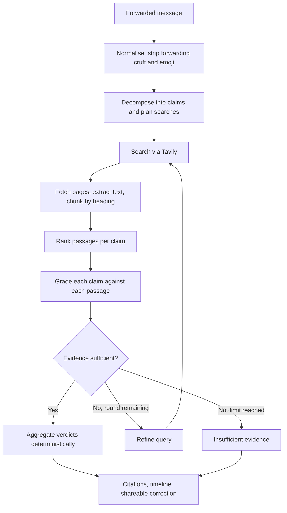

# ForwardCheck

Paste a forwarded message. Get a separate, evidence-backed verdict for every claim in it.


## Overview

ForwardCheck is a bounded agentic RAG system for claim-level verification of
Singapore-focused forwarded messages — the kind that circulate in WhatsApp and
Telegram groups about government policies, fines, deadlines, eligibility rules,
public advisories, product and food recalls, and transport or community
announcements.

It decomposes a message into independently checkable claims, searches the live web
for each one, fetches and reads the pages it finds, grades each claim against the
retrieved passages, and returns a verdict, an explanation and a citation per claim.
When evidence is insufficient or conflicting it refines its query and searches
again, within a hard budget. When it still cannot find qualifying evidence, it says
so rather than guessing.

The design premise is that these messages are rarely fabricated outright. They
usually start from something real — an actual policy, an actual recall — and then
overstate it. A maximum penalty becomes automatic. One recalled batch becomes every
bottle. A benefit per household becomes one per person. A deadline two years away
becomes next week. A single true-or-false answer cannot express that, and answering
"false" to a message that is half correct hands anyone who knows the true half a
reason to dismiss the correction entirely.

ForwardCheck verifies **factual claims**, not sender intent. It is not a scam or
phishing detector.

## Why not a general web-search assistant?

| General web-search assistant | ForwardCheck |
|---|---|
| You formulate the question | You paste the message unchanged |
| Usually answers at message level | Separates and verifies each claim independently |
| General source selection | Weights official Singapore sources above news, news above secondary |
| May smooth over subtle exaggeration | Explicitly checks status, scope, modality, dates and amounts |
| Conversational answer | Structured verdicts with evidence mapped per claim |
| One search pass | Re-searches per claim when evidence is insufficient or conflicting |

## Example

Real output from a live run. Both sources are genuine URLs the pipeline retrieved
and read.

> From 1 Sept, HDB cat owners with more than 2 cats will automatically be fined
> $5,000 and AVS will remove the extra cats. All cats, including community cats,
> must be licensed by 31 Aug. Forward to all cat owners.

**Overall: Misleading** (confidence 0.58, 19 evidence passages)

| Extracted claim | Verdict | Key reason | Source |
|---|---|---|---|
| Owners with more than 2 cats will automatically be fined $5,000 | **Misleading** | Source says fines of *up to* $5,000 for non-compliance — conditional, not automatic | [straitstimes.com](https://www.straitstimes.com/singapore/community/cat-licensing-scheme-to-kick-in-on-sept-1-in-singapore) (full page) |
| AVS will remove the extra cats | **Insufficient evidence** | Retrieved sources touch the topic but none confirm this | — |
| Cats must be licensed by 31 Aug | **Misleading** | Official source states the deadline is 31 August **2026**, the end of a transition period | [nparks.gov.sg](https://www.nparks.gov.sg/news/news-detail/cat-owners-reminded-to-license-their-cats-by-31-august-2026-as-transition-period-for-pet-cat-licensing-comes-to-an-end) (snippet) |
| Community cats must be licensed by 31 Aug | **False** | Source scopes the requirement to *pet* cats; community cats are managed separately | [nparks.gov.sg](https://www.nparks.gov.sg/news/news-detail/cat-owners-reminded-to-license-their-cats-by-31-august-2026-as-transition-period-for-pet-cat-licensing-comes-to-an-end) (snippet) |

The second row is the system declining to answer rather than guessing. The third
shows why live retrieval matters: the correct 2026 date came from a page fetched at
verification time.

## How it works



1. **Normalise** — strips forwarding appeals, emoji and urgency banners. What was
   removed is recorded, since "this message told you to forward it" is itself a signal.
2. **Decompose and plan** — one Anthropic call with structured output returns atomic
   claims with entities, organisations, dates, amounts, status type and jurisdiction,
   *plus* one or two targeted queries each. Combining both halves the request cost.
   Every claim must trace back to a span of the original message; claims that cannot
   be traced are discarded as hallucinated extractions.
3. **Search** — Tavily, with `site:` operators targeting official domains first and
   an unrestricted Singapore-scoped query as fallback.
4. **Fetch and chunk** — top results are fetched over a streamed, size-capped,
   SSRF-guarded connection, boilerplate is stripped, and text is split on heading and
   paragraph boundaries with full provenance attached.
5. **Rank** — per claim, by lexical relevance multiplied by exact anchor matches,
   source tier and freshness.
6. **Grade** — all (claim, passage) pairs in one structured Anthropic call.
7. **Decide or refine** — sufficient evidence ends the loop; insufficient,
   conflicting or outdated-only evidence earns one more round.
8. **Aggregate** — deterministic rules produce verdicts, confidence, the status
   timeline and a shareable correction.

## Claim decomposition vs document chunking

Two different operations, easy to conflate:

- **Claim decomposition** splits the *user's forwarded message* into independently
  verifiable assertions. Semantic, done by the LLM with structured output.
- **Document chunking** splits a *retrieved source page* into gradeable passages.
  Structural and fully deterministic: heading-aware, paragraph-preserving, 1400
  characters with 150 characters of overlap so a fact straddling a boundary appears
  whole in at least one chunk. Every chunk carries source URL, title, publisher,
  tier, publication date, retrieval timestamp, jurisdiction, originating query,
  heading, and whether it came from a full page or a search snippet.

## Bounded agentic retrieval

The pipeline decides whether to search again, and records why. A claim earns a
second round when:

- **no qualifying evidence** — nothing graded above the confidence floor
- **sources conflict** — qualifying evidence both supports and refutes it
- **evidence appears outdated** — every qualifying passage is marked superseded

On a second round the model's refined query for that claim is used, or a fallback
query built from the claim text. Every extra round is written to the trace with its
reason and surfaced in the developer panel.

The loop is bounded: at most **2 rounds per claim**, under per-request search and
fetch budgets. It stops as soon as evidence is adequate rather than always running
to the limit. When limits are reached with evidence still insufficient, the claim
abstains. This bounds latency and spend together.

## Verdict framework

| Verdict | Meaning |
|---|---|
| `Supported` | Evidence backs the claim as stated |
| `Misleading` | Partly true, but status, scope, modality or timing is overstated |
| `False` | Evidence directly contradicts the claim |
| `Outdated` | Supported only by evidence the grader marked as superseded |
| `Insufficient evidence` | No retrieved source answers the claim either way |

The distinctions that matter most in practice:

- **Maximum vs automatic** — "liable on conviction to a fine up to $5,000" does not
  support "you will automatically be fined $5,000"
- **Some vs everyone** — one recalled batch is not every product; a household
  benefit is not a per-person one; pet cats are not all cats
- **Proposed vs passed vs effective vs enforced** — a law passing does not mean it
  is in force, and being in force does not mean penalties have started
- **Overseas vs Singapore** — a recall in another market is not a local recall
- **Once true vs currently true** — a real announcement since superseded is
  `Outdated`, not `Supported`

**Every non-abstaining verdict requires qualifying evidence.** A claim with no
retrieved passage graded above the confidence floor returns `Insufficient evidence`
rather than a guess, and every non-abstaining verdict cites at least one evidence
ID. This is enforced in code and asserted in tests.

## Retrieval and evidence pipeline

**Retrieval is lexical and metadata-aware — not semantic.** No embeddings are
generated anywhere in this repository, and no vector database is used.

**Source authority** is a deterministic domain allowlist mapping Singapore
government and statutory-board domains, Singapore Statutes Online and the courts,
and established Singapore newsrooms to four tiers with fixed weights:

| Tier | Weight | Examples |
|---|---|---|
| `primary` | 1.00 | Singapore Statutes Online, judiciary.gov.sg |
| `official` | 0.90 | gov.sg, nparks.gov.sg, hsa.gov.sg, sfa.gov.sg, mom.gov.sg, police.gov.sg |
| `credible_news` | 0.65 | CNA, The Straits Times, TODAY, Mothership, Mediacorp |
| `secondary` | 0.30 | everything else |

Domains outside the allowlist are kept but weighted as `secondary` — a developing
story sometimes only has uncatalogued coverage, and discarding it would turn "we
found weaker evidence" into "we found nothing". They can never outrank an official
source on authority alone.

**Fetching treats every URL as untrusted input**, because URLs arrive from an
external search provider. Only `http`/`https`; hostnames are resolved and rejected
if they map to private, loopback, link-local, multicast or reserved space; redirects
are re-validated at each hop, since a redirect into internal space is a standard
SSRF pivot; the body is **streamed and capped** so an oversized response is never
buffered into memory; timeouts, redirect counts and content types are all enforced.
Login walls and paywalls are not bypassed. When a fetch fails, the search snippet is
kept as **explicitly weaker evidence** — scored down and labelled in the UI.

**Ranking** combines token overlap with boosts for exact amount, entity and date
matches, then multiplies by tier weight and a freshness factor. Passages with
near-zero lexical relevance are dropped entirely — **authority multiplies relevance,
it never substitutes for it** — so an irrelevant official page cannot displace a
relevant one. Materially duplicate passages are removed by content fingerprint, and
each claim keeps at most three passages.

**Citation mapping.** Every grade names a specific (claim, evidence) pair. Grades
naming a pair the pipeline never created are discarded, so the model cannot invent
citations. Each evidence card lists which claims it supports and which it refutes.

**Prompt-injection handling.** Forwarded messages and fetched webpages are both
attacker-controllable. Claims and evidence are wrapped in explicit delimiters, and
the system prompts state that delimited text is data to be analysed, never
instructions — including instructions to change role, reveal the prompt, use outside
knowledge, or mark claims as supported. Adversarial cases are covered by tests.

**What grounding does and does not buy.** Retrieval constrains the model to judge
supplied passages rather than recall, which substantially reduces unsupported
generation. **It does not guarantee truth.** A source can be wrong, a passage can be
misread, and a citation shows provenance rather than proof.

**Why live retrieval rather than a prebuilt index.** Policies, advisories, recalls
and deadlines change. A static index answers with whatever was true when it was
built — which for this problem is the failure mode itself, since a forwarded message
is often a real announcement that has since been superseded.

## Cost controls

Every provider request is charged to a per-request meter *before* it is sent, so
retries consume budget exactly as they consume money. Exceeding a limit degrades to
abstention rather than raising.

| Limit | Default | Variable |
|---|---|---|
| Claims per message | 6 | `FORWARDCHECK_MAX_CLAIMS` |
| LLM provider requests | 3 | `FORWARDCHECK_MAX_LLM_CALLS_PER_REQUEST` |
| Search rounds per claim | 2 | `FORWARDCHECK_MAX_SEARCH_ROUNDS` |
| Search provider requests | 8 | `FORWARDCHECK_MAX_SEARCHES_TOTAL` |
| Page fetches | 8 | `FORWARDCHECK_MAX_FETCHES_TOTAL` |
| Sources per claim | 3 | `FORWARDCHECK_MAX_SOURCES_PER_CLAIM` |
| Request timeout (s) | 20 | `FORWARDCHECK_REQUEST_TIMEOUT_SECONDS` |

Limits are validated at startup — an out-of-range value raises rather than being
silently clamped.

- **Limits count billable requests, not logical operations.** A retried call
  consumes two units of budget, and a retry that would exceed the cap is refused.
- **Nothing runs on page load**, and loading an example makes no request.
  Verification happens only on explicit submit; double submission is blocked.
- **Batched calls** — decomposition and query planning share one call; all pairs in
  a round are graded in one call.
- **TTL caches** for searches (6h), fetched pages (48h) and whole results (30m),
  keyed by provider, query, model and budget configuration so results from
  materially different setups never mix. A cached result reports **zero new provider
  calls** for the current request while preserving the original run's provenance.
  Authentication errors and malformed responses are never cached.
- **Retry policy** — exactly one bounded retry with backoff for transient 429/5xx.
  Authentication, permission and quota errors are never retried.
- **Usage is reported, not estimated** — logical operations, billable requests,
  retries, fetches, cache hits and token counts appear in the developer panel. No
  dollar figures, since that would require pricing this repository does not verify.

## Architecture

| Layer | Responsibility | Implementation |
|---|---|---|
| Frontend | Submission, verdicts, evidence display | Next.js 16, React 19, TypeScript, Tailwind v4 |
| Backend API | Routing, validation, rate limiting, error mapping | FastAPI, Pydantic v2 |
| Claim analysis | Structured decomposition and query planning | Anthropic Messages API, Pydantic-validated |
| Retrieval | Search, fetch, extract, chunk, rank | Tavily + httpx + stdlib parser; lexical ranking |
| Evidence grading | Claim–passage relationships | Anthropic, batched, Pydantic-validated |
| Verdict engine | Aggregation, confidence, timeline, correction | **Deterministic Python** |
| Cache | Reuse of searches, pages, results | File-based TTL cache |

The split is deliberate: the LLM produces *evidence relationships*, and code
produces *verdicts*. Anything a user acts on is computed by rules that can be
tested, not generated as prose.

## Tech stack

| Layer | Technology |
|---|---|
| Frontend | Next.js 16 (App Router), React 19, TypeScript, Tailwind CSS v4 |
| Backend | FastAPI, Pydantic v2, Python 3.13, Uvicorn |
| LLM | Anthropic Messages API via the official `anthropic` SDK, structured outputs validated with Pydantic |
| Search | Tavily Search API via `httpx` |
| Fetching | `httpx` streaming + stdlib `HTMLParser`, with SSRF and size guards |
| Ranking | Lexical overlap with entity/date/amount, tier and freshness weighting |
| Cache | File-based TTL cache under `backend/.cache/` |
| Testing | pytest, fully offline |

No vector database, no embedding model, no orchestration framework. The pipeline is
a small custom state runner.

## Project structure

```
backend/
  app/
    main.py                FastAPI: /verify, /health, /config; rate limiting,
                           startup validation, safe error mapping
    config.py              Mode switch, budgets, TTLs, .env loading
    models/
      schemas.py           API request/response models
      llm_schemas.py       Pydantic schemas for every structured LLM call
      status.py            Status ladders, claim axes, domain mappings
    pipeline/
      live.py              Orchestrator and bounded retrieval loop
      chunk.py             Heading-aware chunking with provenance metadata
      rank.py              Lexical + metadata-aware passage ranking
      normalise.py … verdict.py    Deterministic nodes (shared with tests)
      runner.py            Mode dispatch
    services/
      llm_adapter.py       Anthropic adapter: structured, budgeted, retry-bounded
      search_adapter.py    Tavily adapter and Singapore domain tier map
      fetch.py             SSRF-guarded streaming fetch and text extraction
      cache.py             TTL cache
      usage.py             Per-request meter and budget enforcement
    tests/                 Offline test suite + conftest cost guard
  scripts/
    live_smoke.py          Opt-in paid smoke test (never run by pytest)
    run_eval.py            Offline regression report

frontend/src/
  app/page.tsx             Page composition and mode badge
  components/              One component per result section
  lib/{api,types}.ts       Typed client mirroring the backend schema
```

## Getting started

**Prerequisites:** Python 3.11+, Node.js 18+, and API keys for Anthropic and Tavily.

```bash
git clone https://github.com/yijiechong13/forwardcheck.git
cd forwardcheck
```

**Backend** — macOS / Linux:

```bash
cd backend
python3 -m venv .venv && source .venv/bin/activate
pip install -r requirements.txt
```

**Backend** — Windows (PowerShell):

```powershell
cd backend
python -m venv .venv; .\.venv\Scripts\Activate.ps1
pip install -r requirements.txt
```

**Configure providers:**

```bash
cp backend/.env.example backend/.env
```

`backend/.env` is gitignored and **must never be committed**. Set:

```env
FORWARDCHECK_MODE=live
ANTHROPIC_API_KEY=your_anthropic_api_key
TAVILY_API_KEY=your_tavily_api_key
```

| Variable | Required | Purpose | Default |
|---|---:|---|---|
| `FORWARDCHECK_MODE` | yes | `live` for real verification | `mock` |
| `ANTHROPIC_API_KEY` | yes | Claim decomposition and grading | — |
| `TAVILY_API_KEY` | yes | Web search | — |
| `ANTHROPIC_MODEL` | no | Model id | `claude-haiku-4-5` |
| `FORWARDCHECK_MAX_*` | no | Per-request budgets | see [Cost controls](#cost-controls) |
| `FORWARDCHECK_CACHE_TTL_*` | no | Cache lifetimes (seconds) | 6h / 48h / 30m |
| `FORWARDCHECK_CHUNK_MAX_CHARS` | no | Chunk size | `1400` |
| `FORWARDCHECK_CORS_ORIGINS` | no | Allowed origins | localhost:3000 |

**Run** (two terminals):

```bash
cd backend && uvicorn app.main:app --reload --port 8000
```

```bash
cd frontend && npm install && npm run dev
```

Open http://localhost:3000. API docs at http://localhost:8000/docs.

`GET /health` reports whether each provider is configured **as booleans** — key
values are never returned, logged, or sent to the frontend. With `FORWARDCHECK_MODE=live`
and a key missing, the backend **refuses to start** rather than silently degrading.

## Development and testing

```bash
cd backend && .venv/bin/python -m pytest app/tests -v
```

**Tests never call a paid API.** The suite exercises the live orchestrator with fake
adapters, and for pipeline-logic tests it runs an offline deterministic path over a
small seeded evidence corpus. `app/tests/conftest.py` forces that offline mode and
strips provider keys at collection time, so running `pytest` costs nothing even when
`backend/.env` is configured for live use. One test asserts no sockets are opened.

Coverage includes decomposition validation, retrieval, batched grading, the
refinement loop, budget and retry accounting, SSRF rejection, streamed size limits,
chunking, cache expiry and key separation, prompt-injection resistance, duplicate
claim handling, abstention, malformed and invented model output, and assertions that
no endpoint leaks key material.

```bash
cd backend && .venv/bin/python scripts/run_eval.py --verbose
```

> This offline evaluation is a **regression suite over curated examples, not an
> estimate of real-world accuracy.** Its corpus was written for those cases, so a
> high score shows known behaviour has not regressed and nothing more. No real-world
> accuracy claim is made.

### Opt-in live smoke test (spends money)

Never run by pytest, CI, or application startup:

```bash
cd backend && FORWARDCHECK_MODE=live .venv/bin/python scripts/live_smoke.py --yes-spend-money
```

One verification, bounded to at most 3 LLM requests and 8 searches. It refuses to
run without the explicit flag and prints verdicts, citations and the usage summary —
never prompts or credentials.

## API

```
POST /verify        { "message": "..." }
```

Returns:

```jsonc
{
  "overallVerdict": "Misleading",
  "summary": "...",
  "confidence": 0.58,
  "lastChecked": "2026-08-20T...",
  "claims": [ { "id", "text", "verdict", "confidence", "keyReason",
                "evidenceIds", "grades", "statusType", "domain" } ],
  "evidence": [ { "id", "title", "publisher", "tier", "url", "snippet",
                  "publishedAt", "fromFullPage",
                  "supportsClaimIds", "refutesClaimIds" } ],
  "timeline": [ { "stage", "label", "found", "description", "evidenceIds" } ],
  "shareableCorrection": "...",
  "pipelineTrace": [ { "step", "node", "summary", "durationMs", "details" } ]
}
```

`GET /health` — mode, provider configuration as booleans, startup problems.
`GET /config` — effective budgets and cache TTLs. Neither returns key material.

## Limitations

- **Retrieval grounding reduces unsupported generation but does not guarantee
  truth.** A source can be wrong, a passage can be misread, and a citation shows
  provenance rather than proof. Citations warrant review.
- **Verification quality is unmeasured on live retrieval.** There is no
  human-reviewed dataset of unseen live verifications, so no accuracy figure is
  claimed.
- **Results depend on what is findable.** If an authoritative page is not indexed,
  is behind a login, or cannot be fetched, a claim may abstain even though official
  information exists.
- **Snippet-only evidence is weaker.** When a fetch fails the search snippet is
  used, scored down and labelled — but a snippet can omit the qualifying clause that
  decides a verdict.
- **Conflicting official and news sources can drive abstention** rather than a
  confident answer.
- **Ranking is lexical.** A claim phrased differently from its source ("milk powder"
  vs "infant formula") can rank the right page too low.
- **Extraction is simple.** Government advisory pages parse well; heavily scripted
  pages may extract poorly.
- **Singapore and English only.**
- **Rate limiting is in-process** — suitable for single-process use.
- **Not deployed.** Local development only; no deployment configuration exists.
- **Informational only.** Not legal, medical, or financial advice.

## Future improvements

- Human-reviewed evaluation set of unseen forwarded messages
- Citation-entailment checking
- Historical policy-version tracking, to strengthen outdated-claim detection
- OCR for forwarded screenshots
- Multilingual and Singlish claim extraction
- Confidence calibration — current values are uncalibrated heuristics

## Responsible use

ForwardCheck assists with verification but does not replace official advice. For
decisions with legal, financial, health or safety consequences, open and review the
cited authoritative source directly.

## License

MIT
