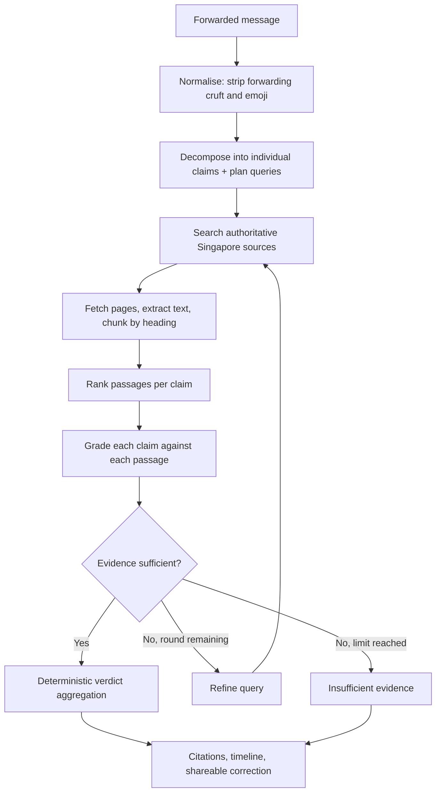

# ForwardCheck

Paste a forwarded message. Get a verdict for every claim in it, with cited evidence.


## Overview

ForwardCheck is a verification assistant for factual claims in forwarded messages — the kind
that circulate in WhatsApp and Telegram groups about government policies, fines, deadlines,
eligibility rules, public advisories and product recalls. You paste the message in, and it
returns an evidence-backed verdict for each individual claim rather than one blanket judgment
on the whole thing.

The design premise is that these messages are rarely fabricated outright. They usually start
from something real — an actual policy, an actual recall — and then overstate it. The scale of
a penalty grows, a recall of one batch becomes a recall of everything, a rule for one group is
applied to everyone. A single true-or-false answer cannot express that, and answering "false"
to a message that is half correct is its own inaccuracy.

Scope is Singapore-only, and the verification corpus is **seeded sample data** rather than live
web search. See [What this is and is not](#what-this-is-and-is-not) — that distinction matters
for reading everything below, and is stated up front rather than buried.

## What this is and is not

ForwardCheck runs in one of two modes.

| | Mock mode (default) | Live mode |
|---|---|---|
| Claim decomposition | Deterministic rules | Anthropic, structured output, with rule-based fallback |
| Evidence | 38 seeded sample documents | Live web search + page fetching |
| Retrieval | BM25 over an in-memory corpus | Tavily search, then lexical + heuristic ranking |
| Grading | Deterministic rule cascade | Anthropic, one batched structured call per round |
| Verdicts | Deterministic aggregation | Deterministic aggregation (identical rules) |
| API keys | None required | `ANTHROPIC_API_KEY` + `TAVILY_API_KEY` |
| Cost | $0 | Bounded per request (see [Cost controls](#cost-controls)) |

**Mock mode is the default and is what every test and CI run uses.** It makes no
network calls, requires no keys, and is a genuine deterministic baseline — not a
stub. Live mode is opt-in via `FORWARDCHECK_MODE=live`.

In both modes the **verdict is decided by deterministic code**, never by free-form
generation. In live mode the model's job is bounded: extract claims, plan queries,
and judge each (claim, evidence) pair. Aggregation into the five verdict labels,
the citation requirement, and confidence scoring all stay in Python.

Not implemented, and not claimed: vector/semantic retrieval, embeddings,
reranking models, and deployment. This is not a scam or phishing detector — it
evaluates factual claims, not sender intent.

## The problem

A typical forwarded policy message combines:

- a real organisation and a real policy
- a plausible but incorrect date or deadline
- an exaggerated consequence (a maximum penalty presented as automatic)
- missing eligibility conditions (a household benefit described as per-person)
- an outdated announcement presented as current
- an instruction to forward it onward

Keyword matching cannot separate these, because the keywords are genuine — the message really is
about cat licensing, and there really is a $5,000 figure in the legislation. A single web search
does not resolve it either, since the top result usually confirms the *topic* while saying nothing
about the *specific* assertion. What is needed is claim-by-claim comparison against a source that
states the actual scope and modality.

## How it works



1. **Normalise** — strips forwarding appeals, emoji and urgency banners. What was
   removed is recorded, since "this message told you to forward it" is informative.
2. **Decompose + plan** — one structured call returns atomic claims with their
   entities, dates, amounts, status type and jurisdiction, *plus* 1–2 targeted
   search queries each. Doing both in one call halves the request cost. Every
   claim must quote an exact span of the original message; claims whose span is
   not present are discarded as hallucinated extractions.
3. **Search** — queries prefer official Singapore sources (`site:` operators on
   gov.sg domains) with an unrestricted Singapore-scoped query as backup.
4. **Fetch and chunk** — top results are fetched (snippets alone are too short to
   verify a status claim), boilerplate is stripped, and text is chunked on
   heading and paragraph boundaries with full provenance metadata attached.
5. **Rank** — lexical relevance, multiplied by exact entity/date/amount matches,
   source tier and freshness. Authority multiplies relevance, never substitutes
   for it, so an irrelevant official page cannot outrank a relevant one.
6. **Grade** — all (claim, passage) pairs in **one** structured call, returning a
   relationship, matched/contradicted/missing aspects, temporal status, rationale
   and an exact quoted span per pair.
7. **Decide or refine** — a claim with no qualifying evidence, or with conflicting
   or outdated evidence, gets **one** refined search round. Otherwise the loop
   stops immediately. The reason for every extra round is written to the trace.
8. **Aggregate** — deterministic rules produce the final verdicts, confidence, the
   status timeline and the shareable correction.

### Claim decomposition vs document chunking

Two different operations that are easy to conflate:

- **Claim decomposition** splits the *user's forwarded message* into independently
  verifiable assertions. Semantic, done by the LLM (or rules in mock mode).
- **Document chunking** splits a *retrieved source page* into gradeable passages.
  Structural, done deterministically on heading and paragraph boundaries.

### Why live search rather than a pre-built index

Policies, advisories, recalls and deadlines change. A static document index would
answer with whatever was true when it was built, which for this problem is the
failure mode itself — a forwarded message is often a real announcement that has
since been superseded. Live retrieval means the evidence is as current as the
source. The cost is latency and per-request spend, which is why the budgets below
are hard limits rather than guidance.

## Example

Real output from the application for one of the seeded example messages:

> From 1 Sept, HDB cat owners with more than 2 cats will be fined $5,000 and AVS will remove the
> extra cats. All cats, including community cats, must be licensed by 31 Aug. Forward to all cat owners.

**Overall verdict: Misleading**

| Extracted claim | Verdict | Explanation |
|---|---|---|
| Cats must be licensed by 31 Aug | **Supported** | Source asserts the same deadline for this matter |
| Owners with more than 2 cats will be fined $5,000 | **Misleading** | Source describes this as a maximum penalty decided case by case, not an automatic consequence |
| AVS will remove the extra cats | **Misleading** | Source states owners will not be required to give up their animals |
| Community cats must be licensed by 31 Aug | **Misleading** | Source places this group outside the scope of the rule |

One claim is genuinely correct. Returning "false" for the whole message would misrepresent it and
would give anyone who knows the deadline is real a reason to dismiss the correction entirely.

The seeded example messages are **synthetic, forwarded-style claims written to resemble real
Singapore public information**. They are not captured private messages.

## Verdict labels

The application uses a closed set of five labels:

| Label | Meaning |
|---|---|
| `Supported` | Evidence backs the claim as stated |
| `Misleading` | Partly true, but the status, scope or certainty is overstated |
| `False` | Evidence directly contradicts the claim |
| `Outdated` | Supporting evidence exists but is older than the freshness threshold |
| `Insufficient evidence` | No retrieved source addresses the claim either way |

The vocabulary is closed because free-text verdicts cannot be evaluated. `Insufficient evidence`
is a first-class outcome, not a failure path: when retrieval returns nothing above threshold, the
pipeline abstains instead of producing a confident answer. The evaluation harness measures this
explicitly.

## Key features

**Claim-level verification.** A message becomes separate claims, each with its own
verdict, confidence, cited evidence and explanation. One claim being true does not
drag the others up, or down.

**Three axes of overstatement.** Beyond status escalation (`investigated` →
`charged`), grading targets *scope* (one batch → all products; per household → per
person) and *modality* (up to $5,000 on conviction → automatically fined). These
are independent — a claim can get the status exactly right and still be false on
both other axes.

**Bounded agentic retrieval.** The pipeline decides whether to search again, and
says why: no qualifying evidence, sources conflict, or evidence looks outdated.
Capped at two rounds per claim and a total search budget; when limits are reached
it abstains rather than guessing. The reason for every extra round is in the trace.

**Time-aware handling.** Evidence carries publication dates; the grader returns a
temporal status per passage; a claim supported *only* by evidence marked outdated
returns `Outdated` rather than `Supported`.

**Abstention as a real outcome.** No qualifying evidence means `Insufficient
evidence`. Every non-abstaining verdict must cite at least one source, asserted in
tests. In live mode, evidence that could only be read as a search snippet (because
the page fetch failed) is down-weighted and labelled as such in the UI.

**Source-tier weighting.** Deterministic, applied at ranking time: `primary` 1.0,
`official` 0.9, `credible_news` 0.65, `secondary` 0.3. Unknown domains are kept but
weighted as secondary — a developing event sometimes only has news coverage — and
can never outrank an official source.

**Verified citations.** Live evidence cards link to the real fetched URL (opening
safely in a new tab); seeded sample evidence uses placeholder URLs that are
deliberately rendered as plain text, so a sample can never be mistaken for a
real citation.

## Cost controls

Live mode spends money, so limits are enforced in code, not documentation. Every
provider call charges a per-request meter *before* it is made, and exceeding a
limit degrades to abstention rather than raising.

| Limit | Default | Env var |
|---|---|---|
| Claims per message | 6 | `FORWARDCHECK_MAX_CLAIMS` |
| LLM calls per request | 3 | `FORWARDCHECK_MAX_LLM_CALLS_PER_REQUEST` |
| Search rounds per claim | 2 | `FORWARDCHECK_MAX_SEARCH_ROUNDS` |
| Searches per request | 8 | `FORWARDCHECK_MAX_SEARCHES_TOTAL` |
| Page fetches per request | 8 | `FORWARDCHECK_MAX_FETCHES_TOTAL` |
| Sources per claim | 3 | `FORWARDCHECK_MAX_SOURCES_PER_CLAIM` |
| Request timeout (s) | 20 | `FORWARDCHECK_REQUEST_TIMEOUT_SECONDS` |

Values are validated at startup — an out-of-range limit raises rather than being
silently clamped.

Also:

- **Nothing runs on page load.** Loading an example into the textarea makes no
  request. Verification happens only on explicit submit, and double submission is
  blocked while a request is in flight.
- **Batched calls.** Decomposition and query planning share one call; all
  (claim, evidence) pairs in a round are graded in one call.
- **Smallest suitable model by default** (`claude-haiku-4-5`), configurable via
  `ANTHROPIC_MODEL`.
- **TTL caches** for searches, fetched pages and whole verification results, keyed
  by provider + query + parameters, so repeated development runs do not repurchase
  the same information. Authentication errors and malformed responses are never
  cached.
- **No automatic retries** on auth, permission or quota errors. Exactly one
  bounded retry with backoff for transient 429/5xx.
- **Usage is reported, not estimated.** The trace shows LLM calls, searches,
  fetches, cache hits, mode and token counts when the provider returns them. No
  dollar estimates are shown, since that would require pricing this repository
  does not verify.

## Retrieval and verification pipeline

**Structured output, validated.** Every LLM interaction goes through
`client.messages.parse(output_format=...)` against a Pydantic model, so malformed
JSON never reaches the pipeline. On a validation failure the adapter retries once;
if that fails it raises rather than accepting arbitrary text. Decomposition
additionally falls back to the deterministic decomposer (disclosed in the trace)
so a provider outage degrades quality rather than breaking the request.

**Search.** Tavily, behind the existing `SearchAdapter` interface. Each result is
normalised to title, canonical URL, publisher, snippet, publication date (when
available), provider relevance score, and the query that produced it.

**Fetching is treated as untrusted input**, because the URLs come from an external
provider. `http`/`https` only; every hostname is resolved and rejected if it maps
to private, loopback, link-local, multicast or reserved space; redirects are
re-validated at each hop (a redirect into internal space is a classic SSRF pivot);
size, timeout, redirect count and content type are all capped. Login walls and
paywalls are not bypassed — a failed fetch keeps the search snippet as explicitly
weaker evidence.

**Extraction** is a dependency-free HTML-to-text pass that skips
nav/header/footer/aside/script and preserves headings as structural markers. It is
not a readability engine; Singapore government advisory pages are structurally
simple, which is what makes this adequate.

**Ranking is lexical and heuristic — not semantic.** There are no embeddings in
this repository. Signals: token overlap, exact entity/date/amount matches, source
tier, freshness, and a penalty for snippet-only evidence. Materially duplicate
passages are deduplicated by content fingerprint.

**Grading** instructs the model to use only the supplied passages, to treat
silence as `does_not_answer` rather than contradiction, and to check subject,
jurisdiction, date, amount, status, scope, modality, eligibility and currency
explicitly. Grades naming a (claim, evidence) pair the pipeline never created are
discarded — the model cannot invent citations.

**Aggregation is deterministic.** Confidence combines evidence agreement, source
tier and retrieval strength; the model's self-reported confidence is one input,
never the whole score. A partially-true claim contradicted on scope, modality or
date resolves to `Misleading`; `False` is reserved for direct substantive
contradiction.

## Architecture

```
Next.js (App Router)  ──POST /verify──▶  FastAPI
                                            │
                            mode = mock ─────┴───── mode = live
                                 │                       │
                    deterministic pipeline      live orchestrator
                    over seeded corpus          (app/pipeline/live.py)
                                                         │
                              ┌──────────────────────────┼──────────────────┐
                              ▼                          ▼                  ▼
                      Anthropic adapter          Tavily adapter      Fetch + chunk
                   (structured decompose,     (search, TTL-cached)   (SSRF-guarded,
                    batched grading)                                 TTL-cached)
                              └──────────────────────────┼──────────────────┘
                                                         ▼
                                        deterministic verdict aggregation
```

Both modes return the same `VerifyResponse` shape, so the frontend renders either
without branching — apart from deliberately showing mode, real-vs-sample citations
and snippet-only evidence differently.

`pipeline/graph.py` remains the deterministic pipeline's state-graph runner. The
live path is a separate orchestrator because its control flow is conditional and
budget-aware, which the linear graph was not designed for. LangGraph is not a
dependency.

## Tech stack

| Layer | Technology |
|---|---|
| Frontend | Next.js 16 (App Router), React 19, TypeScript, Tailwind CSS v4 |
| Backend | FastAPI, Pydantic v2, Python 3.13, Uvicorn |
| LLM | Anthropic Messages API via the official `anthropic` SDK, structured outputs validated with Pydantic |
| Search | Tavily Search API via `httpx` |
| Fetching | `httpx` + stdlib `HTMLParser`, with SSRF and size/timeout guards |
| Retrieval | BM25 (in-repo) for the seeded corpus; lexical + heuristic ranking for live passages. No embeddings. |
| Caching | File-based TTL cache (`backend/.cache/`), swappable behind one class |
| Storage | No database |
| Testing | pytest — 128 tests, all offline and free |
| Deployment | Not deployed |

## Project structure

```
backend/
  app/
    main.py                FastAPI: /verify, /health, /config; rate limiting,
                           startup validation, safe error mapping
    config.py              FORWARDCHECK_MODE, budgets, TTLs, .env loading
    models/
      schemas.py           API request/response models (camelCase on the wire)
      llm_schemas.py       Pydantic schemas for every structured LLM call
      status.py            Status ladders, claim axes, domain mappings
    pipeline/
      live.py              Live orchestrator: bounded agentic retrieval loop
      chunk.py             Heading-aware document chunking with provenance
      rank.py              Lexical + heuristic passage ranking
      graph.py             State-graph runner for the deterministic pipeline
      normalise.py … verdict.py   Deterministic pipeline nodes
      runner.py            Mode dispatch
    services/
      llm_adapter.py       Anthropic adapter, structured + budget-aware
      search_adapter.py    Tavily adapter + Singapore domain tier map
      fetch.py             SSRF-guarded fetching and text extraction
      cache.py             TTL cache
      usage.py             Per-request meter and hard budget enforcement
      retrieval_adapter.py BM25 over the seeded corpus
    data/mock_sources.py   38 seeded sample documents, 9 topic clusters
    eval/harness.py        Regression scoring for the deterministic pipeline
    tests/                 128 tests (see Testing)
  scripts/
    run_eval.py            Mock-mode regression report
    live_smoke.py          Opt-in paid smoke test (never run by pytest)

frontend/src/
  app/page.tsx             Page composition, mode badge
  components/              One component per result section
  lib/{api,types}.ts       Typed client mirroring the backend schema
```

## Getting started

**Prerequisites:** Python 3.11+ and Node.js 18+.

```bash
git clone https://github.com/yijiechong13/forwardcheck.git
cd forwardcheck
```

**Backend**

```bash
cd backend
python3 -m venv .venv && source .venv/bin/activate
pip install -r requirements.txt
uvicorn app.main:app --reload --port 8000
```

**Frontend** (separate terminal)

```bash
cd frontend
npm install
npm run dev
```

Open http://localhost:3000. Interactive API docs at http://localhost:8000/docs.

This runs in **mock mode** — no keys, no network calls, no cost. The header shows
`DEMO MODE — SEEDED SAMPLE EVIDENCE`.

### Enabling live mode

Copy the template and fill in your own keys:

```bash
cp backend/.env.example backend/.env
```

`backend/.env` is gitignored. Set:

```env
FORWARDCHECK_MODE=live
ANTHROPIC_API_KEY=your_anthropic_api_key
TAVILY_API_KEY=your_tavily_api_key
ANTHROPIC_MODEL=claude-haiku-4-5
```

Restart the backend. `GET /health` reports whether each provider is configured
(as booleans — key values are never returned, logged, or sent to the frontend),
and the header switches to `LIVE VERIFICATION`. If a key is missing, the backend
**refuses to start in live mode** rather than silently falling back to mock.

All other variables are optional; see [Cost controls](#cost-controls) for the
budget knobs and `backend/.env.example` for the complete list with defaults.

### Testing

```bash
cd backend && .venv/bin/python -m pytest app/tests -v
```

**All 128 tests run in mock mode with mocked providers and cost nothing**, even
when `backend/.env` is configured for live mode — `app/tests/conftest.py` forces
mock and strips provider keys at collection time, so running pytest can never
spend money. One test asserts mock-mode verification opens no sockets at all.

```bash
cd backend && .venv/bin/python scripts/run_eval.py --verbose
```

The evaluation harness scores the *deterministic* pipeline against a labelled set
of 10 messages and 24 gold claims. **This is regression testing, not a real-world
accuracy estimate** — the seeded corpus was written for these cases, so a high
score demonstrates that known behaviour has not changed. It says nothing about
performance on unseen messages, and no accuracy claim is made from it.

### Opt-in live smoke test (spends money)

Never run by pytest, CI, or application startup. One verification, bounded by the
default budgets to at most 3 LLM calls and 8 searches:

```bash
cd backend && FORWARDCHECK_MODE=live .venv/bin/python scripts/live_smoke.py --yes-spend-money
```

It refuses to run without the explicit flag, and prints verdicts, citations and
the usage summary — never prompts or credentials.

## Limitations

- **Live results depend on what is findable.** If an authoritative page is not
  indexed by the search provider, is behind a login, or cannot be fetched, the
  claim may come back `Insufficient evidence` even though official information
  exists. Abstention is the intended failure direction, but it is still a miss.
- **A citation is not a proof.** The system shows which passage produced a grade
  and quotes from it. It does not formally verify that the passage entails the
  conclusion, and LLM-produced grades can be wrong.
- **Grading quality is unmeasured on live retrieval.** The evaluation harness
  covers the deterministic pipeline only. There is no labelled dataset of unseen
  live verifications, so no accuracy figure is claimed for live mode.
- **Ranking is lexical and heuristic.** A claim phrased differently from its
  source ("milk powder" vs "infant formula") can rank the right page too low.
  This is the clearest argument for adding dense retrieval.
- **Extraction is simple.** Government advisory pages parse well; complex or
  heavily scripted pages may extract poorly, in which case the search snippet is
  used and labelled as weaker evidence.
- **Singapore and English only.**
- **Rate limiting is in-process.** Suitable for single-process local use, not for
  a multi-instance deployment.
- **Not deployed.** Local development only.
- **This is an informational tool.** It does not replace official guidance.

## Future improvements

- A labelled evaluation set of unseen forwarded messages, for genuine live-mode
  accuracy measurement (not self-labelled by the same model)
- Automated citation-entailment checking
- Dense retrieval to address vocabulary mismatch. A vector store would need a real
  purpose — caching authoritative documents, searching long PDFs, or retaining
  historical policy versions for outdated-claim detection — rather than existing
  so the README can name one
- Confidence calibration; current values are uncalibrated heuristics
- OCR for forwarded screenshots
- Additional jurisdictions and languages

## Responsible use

ForwardCheck is an informational verification aid. Verdicts are produced by rule-based analysis of
a seeded document corpus and may be incomplete or wrong. For any decision with legal, financial,
medical or safety consequences, consult the relevant official source directly rather than relying
on this tool.

## License

MIT
