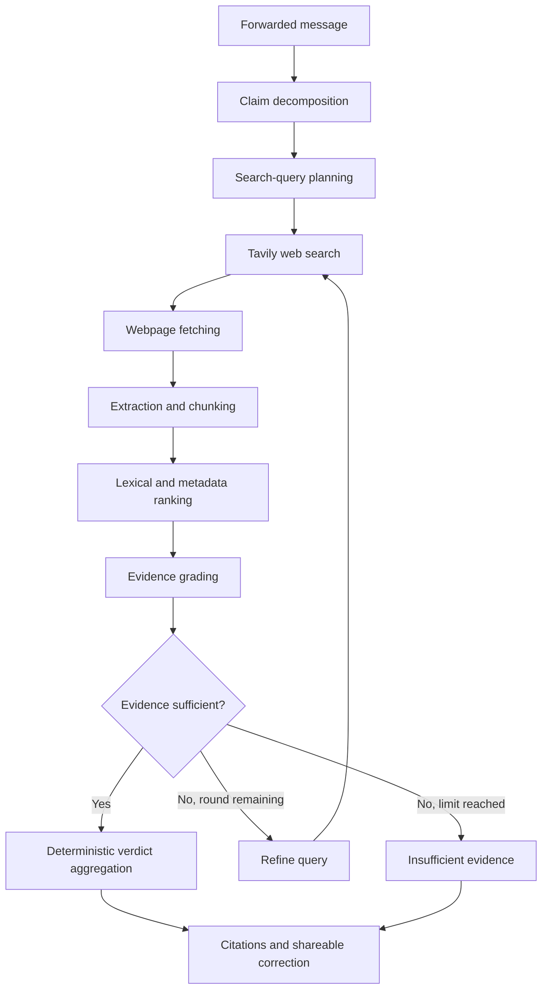

# ForwardCheck

**Paste a forwarded message. Get a separate, evidence-backed verdict for every claim in it.**


## Overview

ForwardCheck is an evidence-grounded, bounded agentic RAG system for checking
factual claims in Singapore-related forwarded messages — the ones circulating in
WhatsApp and Telegram groups about government policies, fines, deadlines,
eligibility rules, public advisories, product and food recalls, and transport or
community announcements.

These messages are rarely invented outright. They usually start from something real
and overstate it: a maximum penalty becomes automatic, one recalled batch becomes
every bottle, a benefit per household becomes one per person, a deadline two years
away becomes next week. A single true-or-false answer cannot express that — and
calling a half-true message "false" gives anyone who knows the true half a reason to
dismiss the correction entirely.

So ForwardCheck breaks the message into individual claims, searches the live web for
each one, reads the pages it finds, and returns a verdict, an explanation and a
citation **per claim**. It verifies factual claims, not sender intent; it is not a
scam or phishing detector.

## Features

**Claim-Level Decomposition**
One message becomes several independently verifiable claims, each with its own
verdict. Exact amounts, dates, organisations and modality words ("up to", "all",
"automatically") are preserved, because those are usually where the distortion lives.

**Live Web Retrieval**
Every claim is searched at verification time via Tavily, with `site:` operators
targeting official Singapore domains first. Policies, advisories, recalls and
deadlines change — a prebuilt index would answer with whatever was true when it was
built, which is the exact failure mode being checked.

**Context-Aware Document Chunking**
Retrieved pages are fetched and split on heading and paragraph boundaries (1400
characters, 150 overlap), so a fact straddling a boundary still appears whole
somewhere. Each chunk carries its URL, publisher, tier, date, heading and
originating query.

**Evidence Ranking and Grading**
Passages are ranked by lexical overlap, boosted for exact entity/date/amount matches
and weighted by source tier and freshness. The model then grades every
(claim, passage) pair — supports, refutes, partially supports, or does not answer —
using only the supplied text.

**Bounded Agentic Re-Search**
When a claim's evidence is missing, conflicting or outdated, the system rewrites the
query and searches again — at most one extra round per claim, under a hard request
budget, with the reason recorded in the trace.

**Evidence-Based Verdicts and Abstention**
Verdicts are computed by deterministic Python from the graded evidence, never
generated as prose. Without qualifying evidence, the answer is
`Insufficient evidence`.

**Traceable Sources**
Every non-abstaining verdict cites the passages behind it, linked to the real URL
and labelled with publisher, tier, date, and whether it came from a full page or
only a search snippet.

**Cost and Safety Controls**
Hard per-request budgets on billable provider calls, TTL caching, SSRF-guarded and
size-capped fetching, prompt-injection defences, and a test suite that cannot spend
money.

## Example

Real output from a live run. Both sources are genuine URLs the pipeline retrieved.

> From 1 Sept, HDB cat owners with more than 2 cats will automatically be fined
> $5,000 and AVS will remove the extra cats. All cats, including community cats,
> must be licensed by 31 Aug. Forward to all cat owners.

**Overall: Misleading** — 4 claims, 19 evidence passages

| Extracted claim | Verdict | Key reason | Source |
|---|---|---|---|
| Owners with more than 2 cats will automatically be fined $5,000 | **Misleading** | Source says fines of *up to* $5,000 for non-compliance — conditional, not automatic | [straitstimes.com](https://www.straitstimes.com/singapore/community/cat-licensing-scheme-to-kick-in-on-sept-1-in-singapore) |
| AVS will remove the extra cats | **Insufficient evidence** | Retrieved sources touch the topic but none confirm this | — |
| Cats must be licensed by 31 Aug | **Misleading** | Official source gives the deadline as 31 August **2026**, the end of a transition period | [nparks.gov.sg](https://www.nparks.gov.sg/news/news-detail/cat-owners-reminded-to-license-their-cats-by-31-august-2026-as-transition-period-for-pet-cat-licensing-comes-to-an-end) |
| Community cats must be licensed by 31 Aug | **False** | Source scopes the rule to *pet* cats; community cats are managed separately | [nparks.gov.sg](https://www.nparks.gov.sg/news/news-detail/cat-owners-reminded-to-license-their-cats-by-31-august-2026-as-transition-period-for-pet-cat-licensing-comes-to-an-end) |

Row two is the system declining to answer rather than guessing. Row three shows why
live retrieval matters: the correct 2026 date came from a page fetched during
verification.

## How It Works



Claim decomposition and query planning happen in a single structured LLM call;
grading batches every (claim, passage) pair into one more. A claim earns a second
retrieval round only when its evidence is missing, conflicting, or outdated.

### Claim decomposition vs document chunking

Two different operations that are easy to conflate:

| | Claim decomposition | Document chunking |
|---|---|---|
| **Splits** | The user's forwarded message | A retrieved webpage |
| **Into** | Independently verifiable claims | Evidence passages |
| **How** | LLM, structured output | Deterministic, heading-aware |
| **Purpose** | Decide *what* to verify | Decide *what to grade against* |

Every extracted claim must trace back to a span of the original message; claims that
cannot be traced are discarded as hallucinated extractions.

### Is this really RAG without embeddings?

Yes. ForwardCheck retrieves external evidence and supplies that evidence to the LLM
before any judgement is produced — that is what makes it retrieval-augmented. What
it does **not** use is a vector database, embeddings, or semantic similarity search.
Ranking is lexical and metadata-aware: token overlap, exact anchor matches, source
tier, and recency.

## Architecture

| Layer | Responsibility | Implementation |
|---|---|---|
| Frontend | Submission, verdicts, evidence display | Next.js 16, React 19, TypeScript, Tailwind v4 |
| Backend API | Routing, validation, rate limiting, error mapping | FastAPI, Pydantic v2 |
| Claim analysis | Decomposition and query planning | Anthropic Messages API, Pydantic-validated |
| Retrieval | Search, fetch, extract, chunk, rank | Tavily + httpx + stdlib parser |
| Evidence grading | Claim–passage relationships | Anthropic, batched, Pydantic-validated |
| Verdict engine | Aggregation, confidence, correction | **Deterministic Python** |
| Cache | Reuse of searches, pages, results | File-based TTL cache |

The split is deliberate: the LLM produces *evidence relationships*, and code
produces *verdicts*. Anything a user acts on is computed by rules that can be tested.

**Fetching treats every URL as untrusted**, since URLs come from an external search
provider: `http`/`https` only, hostnames rejected if they resolve to private,
loopback or link-local space, redirects re-validated at each hop, and bodies
streamed with a hard size cap. Failed fetches keep the search snippet as explicitly
weaker evidence.

**Forwarded messages and fetched pages are also untrusted input.** Claims and
evidence are wrapped in delimiters, and the system prompts state that delimited text
is data to be analysed — never instructions to change role, reveal the prompt, or
mark claims as supported. Adversarial cases are covered by tests.

## Source Quality and Verdicts

Source authority comes from a **curated domain-tier registry** — 25 domains, not an
exhaustive list of trustworthy sources:

| Tier | Weight | Registered domains |
|---|---|---|
| `primary` | 1.00 | Singapore Statutes Online, Singapore Judiciary |
| `official` | 0.90 | GOV.SG, NParks/AVS, HSA, SFA, MOM, MOH, ICA, MHA, AGC, CSA, MINDEF, MND, MTI, SPF |
| `credible_news` | 0.65 | CNA, The Straits Times, TODAY, Mothership, Mediacorp/8world |
| `secondary` | 0.30 | Any other Tavily result |

Results from unregistered domains are **retained**, not discarded — a developing
story sometimes only has uncatalogued coverage — but at `secondary` weight they
cannot outrank an official source. Authority multiplies relevance and never replaces
it: a passage with near-zero lexical relevance is dropped regardless of its tier.

### Verdicts

| Verdict | Meaning |
|---|---|
| `Supported` | Evidence backs the claim as stated |
| `Misleading` | Partly true, but status, scope, modality or timing is overstated |
| `False` | Evidence directly contradicts the claim |
| `Outdated` | Supported only by evidence the grader marked as superseded |
| `Insufficient evidence` | No retrieved source answers the claim either way |

The distinctions that matter most: **maximum vs automatic** penalties, **some vs
everyone** in scope, **proposed vs passed vs in force vs enforced**, **overseas vs
Singapore** action, and **once true vs currently true**.

> **RAG does not guarantee truth.** ForwardCheck reduces unsupported generation by
> requiring retrieved evidence for every non-abstaining verdict. When qualifying
> evidence cannot be found, it returns `Insufficient evidence` instead of guessing.

## Cost and Safety Controls

Every provider request is charged to a per-request meter *before* it is sent, so
retries consume budget exactly as they consume money.

| Limit | Default | Variable |
|---|---|---|
| Claims per message | 6 | `FORWARDCHECK_MAX_CLAIMS` |
| LLM provider requests | 3 | `FORWARDCHECK_MAX_LLM_CALLS_PER_REQUEST` |
| Search rounds per claim | 2 | `FORWARDCHECK_MAX_SEARCH_ROUNDS` |
| Search provider requests | 8 | `FORWARDCHECK_MAX_SEARCHES_TOTAL` |
| Page fetches | 8 | `FORWARDCHECK_MAX_FETCHES_TOTAL` |
| Sources per claim | 3 | `FORWARDCHECK_MAX_SOURCES_PER_CLAIM` |
| Request timeout (s) | 20 | `FORWARDCHECK_REQUEST_TIMEOUT_SECONDS` |

- Limits count **billable requests**, not logical operations — a retry that would
  exceed the cap is refused rather than issued.
- Verification runs **only on explicit submit**; nothing fires on page load or when
  an example is selected, and double submission is blocked.
- **TTL caches** for searches (6h), pages (48h) and whole results (30m), keyed by
  provider, query, model and budget configuration. A cached result reports zero new
  provider calls while preserving the original run's provenance.
- **One bounded retry** with backoff for transient 429/5xx. Authentication,
  permission and quota errors are never retried.
- Usage is **reported, not estimated**: operations, billable requests, retries,
  fetches, cache hits and token counts appear in the developer panel. No dollar
  figures, since that would require pricing this repository does not verify.

## Getting Started

**Prerequisites:** Python 3.11+, Node.js 18+, and API keys for Anthropic and Tavily.

```bash
git clone https://github.com/yijiechong13/forwardcheck.git
cd forwardcheck
```

**Backend** — macOS / Linux:

```bash
cd backend
python3 -m venv .venv && source .venv/bin/activate
pip install -r requirements.txt
```

**Backend** — Windows (PowerShell):

```powershell
cd backend
python -m venv .venv; .\.venv\Scripts\Activate.ps1
pip install -r requirements.txt
```

**Configure providers:**

```bash
cp backend/.env.example backend/.env
```

`backend/.env` is gitignored and must never be committed. Set:

```env
FORWARDCHECK_MODE=live
ANTHROPIC_API_KEY=your_anthropic_api_key
TAVILY_API_KEY=your_tavily_api_key
```

| Variable | Required | Purpose | Default |
|---|---:|---|---|
| `FORWARDCHECK_MODE` | yes | `live` for real verification | `mock` |
| `ANTHROPIC_API_KEY` | yes | Claim decomposition and grading | — |
| `TAVILY_API_KEY` | yes | Web search | — |
| `ANTHROPIC_MODEL` | no | Model id | `claude-haiku-4-5` |
| `FORWARDCHECK_MAX_*` | no | Per-request budgets | see above |
| `FORWARDCHECK_CACHE_TTL_*` | no | Cache lifetimes (seconds) | 6h / 48h / 30m |
| `FORWARDCHECK_CHUNK_MAX_CHARS` | no | Chunk size | `1400` |
| `FORWARDCHECK_CORS_ORIGINS` | no | Allowed origins | localhost:3000 |

**Run** (two terminals):

```bash
cd backend && uvicorn app.main:app --reload --port 8000
```

```bash
cd frontend && npm install && npm run dev
```

Open http://localhost:3000. API docs at http://localhost:8000/docs.

`GET /health` reports provider configuration **as booleans** — key values are never
returned, logged, or sent to the frontend. In live mode with a key missing, the
backend refuses to start rather than silently degrading.

## Development and Testing

```bash
cd backend && .venv/bin/python -m pytest app/tests -v
```

**Tests never call a paid API.** Provider adapters are replaced with fakes, and
pipeline-logic tests run a deterministic offline mode over a small seeded evidence
corpus — the same mode reachable via `FORWARDCHECK_MODE=mock` for API-free local
development. `app/tests/conftest.py` forces that mode and strips provider keys at
collection time, so `pytest` costs nothing even with `backend/.env` configured for
live use.

Coverage includes decomposition validation, retrieval, batched grading, the
refinement loop, budget and retry accounting, SSRF rejection, streamed size limits,
chunking, cache expiry and key separation, prompt-injection resistance, duplicate
claim handling, abstention, malformed model output, and assertions that no endpoint
leaks key material.

```bash
cd backend && .venv/bin/python scripts/run_eval.py --verbose
```

> The offline evaluation is a **regression suite over curated examples, not an
> estimate of real-world accuracy.**

**Opt-in live smoke test** (spends money; never run by pytest or CI):

```bash
cd backend && FORWARDCHECK_MODE=live .venv/bin/python scripts/live_smoke.py --yes-spend-money
```

## API

```
POST /verify        { "message": "..." }
```

```jsonc
{
  "overallVerdict": "Misleading",
  "summary": "...",
  "confidence": 0.58,
  "lastChecked": "2026-08-20T...",
  "claims": [ { "id", "text", "verdict", "confidence", "keyReason",
                "evidenceIds", "grades", "statusType", "domain" } ],
  "evidence": [ { "id", "title", "publisher", "tier", "url", "snippet",
                  "publishedAt", "fromFullPage",
                  "supportsClaimIds", "refutesClaimIds" } ],
  "timeline": [ { "stage", "label", "found", "description", "evidenceIds" } ],
  "shareableCorrection": "...",
  "pipelineTrace": [ { "step", "node", "summary", "durationMs", "details" } ]
}
```

`GET /health` — mode, provider configuration as booleans, startup problems.
`GET /config` — effective budgets and cache TTLs. Neither returns key material.

## Limitations

- **Retrieval quality depends on available web sources.** If an authoritative page
  is not indexed, is behind a login, or cannot be fetched, a claim may abstain even
  though official information exists.
- **LLM claim decomposition and evidence grading can still make mistakes** — a claim
  may be split badly, or a passage misread.
- **RAG reduces but does not eliminate hallucinations.** A citation shows provenance,
  not proof, and warrants review.
- **The project still needs broader evaluation on unseen, human-labelled examples.**
  No real-world accuracy figure is claimed.
- Snippet-only evidence is weaker than a full page and can omit the qualifying clause
  that decides a verdict.
- Ranking is lexical, so a claim phrased differently from its source ("milk powder"
  vs "infant formula") can rank the right page too low.
- Singapore and English only; extraction favours simply-structured pages.
- Rate limiting is in-process, suitable for single-process use. Not deployed.
- **ForwardCheck is not professional legal, medical, or government advice.**

## Future Improvements

- Human-reviewed evaluation set of unseen forwarded messages
- Citation-entailment checking
- Historical policy-version tracking, to strengthen outdated-claim detection
- OCR for forwarded screenshots
- Multilingual and Singlish claim extraction
- Confidence calibration — current values are uncalibrated heuristics

## Responsible Use

ForwardCheck assists with verification but does not replace official advice. For
decisions with legal, financial, health or safety consequences, open and review the
cited authoritative source directly.

## License

MIT
