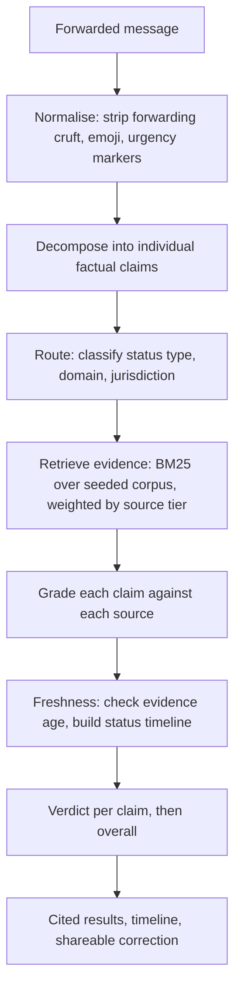

# ForwardCheck

Paste a forwarded message. Get a verdict for every claim in it, with cited evidence.


## Overview

ForwardCheck is a verification assistant for factual claims in forwarded messages — the kind
that circulate in WhatsApp and Telegram groups about government policies, fines, deadlines,
eligibility rules, public advisories and product recalls. You paste the message in, and it
returns an evidence-backed verdict for each individual claim rather than one blanket judgment
on the whole thing.

The design premise is that these messages are rarely fabricated outright. They usually start
from something real — an actual policy, an actual recall — and then overstate it. The scale of
a penalty grows, a recall of one batch becomes a recall of everything, a rule for one group is
applied to everyone. A single true-or-false answer cannot express that, and answering "false"
to a message that is half correct is its own inaccuracy.

Scope is Singapore-only, and the verification corpus is **seeded sample data** rather than live
web search. See [What this is and is not](#what-this-is-and-is-not) — that distinction matters
for reading everything below, and is stated up front rather than buried.

## What this is and is not

Being precise about the current implementation:

| | Status |
|---|---|
| Claim decomposition, routing, retrieval, grading, verdicts | **Implemented**, deterministic (rule-based) |
| Evidence corpus | **38 seeded sample documents**, hand-written to resemble official advisories |
| Retrieval | **Implemented** — BM25 lexical scoring over the in-memory corpus |
| LLM involvement | **None.** No model is called anywhere in the pipeline |
| Live web search / page fetching / scraping | **Not implemented** — interface defined, raises `NotImplementedError` |
| Vector database, embeddings, reranking | **Not implemented** |
| Deployment | **Not deployed** — runs locally |

The LLM and web-search adapters exist as **interfaces with documented contracts and unimplemented
bodies**. They mark where those systems attach; they do not pretend to work. The application runs
end-to-end with no API keys because nothing external is called.

This is a **retrieval-grounded verification pipeline** whose retrieval currently targets a curated
local corpus. It is not a RAG system with a live index, and it is not a scam or phishing detector —
it evaluates factual claims, not sender intent.

## The problem

A typical forwarded policy message combines:

- a real organisation and a real policy
- a plausible but incorrect date or deadline
- an exaggerated consequence (a maximum penalty presented as automatic)
- missing eligibility conditions (a household benefit described as per-person)
- an outdated announcement presented as current
- an instruction to forward it onward

Keyword matching cannot separate these, because the keywords are genuine — the message really is
about cat licensing, and there really is a $5,000 figure in the legislation. A single web search
does not resolve it either, since the top result usually confirms the *topic* while saying nothing
about the *specific* assertion. What is needed is claim-by-claim comparison against a source that
states the actual scope and modality.

## How it works



Each stage is a separate module in `backend/app/pipeline/`, and each appends a step to a trace
that the UI exposes.

1. **Normalise** — removes forwarding appeals, emoji and urgency banners, and normalises date
   references. What was removed is recorded rather than discarded, since "this message told you
   to forward it" is itself informative.
2. **Decompose** — splits the message into individually checkable claims. This handles elided
   subjects (`"arrested at Changi and convicted"` → two claims), appositive scope extensions
   (`"All cats, including community cats"` → the rule and the scope extension separately),
   compound assertions, and causal clauses (a recall and its stated reason).
3. **Route** — classifies each claim by status type (charge, penalty, eligibility, recall scope,
   deadline …), domain, and jurisdiction.
4. **Retrieve** — BM25 lexical scoring over the corpus, multiplied by a source-tier weight, with
   a status-aware boost. Scores below an absolute floor return no results at all.
5. **Grade** — labels each (claim, document) pair `supports`, `refutes`, `partially_supports`
   or `does_not_answer`.
6. **Freshness** — flags evidence older than a configurable threshold and constructs the status
   timeline.
7. **Verdict** — assigns a per-claim verdict and confidence, then an overall label, and writes a
   short correction suitable for sending back to the group.

## Example

Real output from the application for one of the seeded example messages:

> From 1 Sept, HDB cat owners with more than 2 cats will be fined $5,000 and AVS will remove the
> extra cats. All cats, including community cats, must be licensed by 31 Aug. Forward to all cat owners.

**Overall verdict: Misleading**

| Extracted claim | Verdict | Explanation |
|---|---|---|
| Cats must be licensed by 31 Aug | **Supported** | Source asserts the same deadline for this matter |
| Owners with more than 2 cats will be fined $5,000 | **Misleading** | Source describes this as a maximum penalty decided case by case, not an automatic consequence |
| AVS will remove the extra cats | **Misleading** | Source states owners will not be required to give up their animals |
| Community cats must be licensed by 31 Aug | **Misleading** | Source places this group outside the scope of the rule |

One claim is genuinely correct. Returning "false" for the whole message would misrepresent it and
would give anyone who knows the deadline is real a reason to dismiss the correction entirely.

The seeded example messages are **synthetic, forwarded-style claims written to resemble real
Singapore public information**. They are not captured private messages.

## Verdict labels

The application uses a closed set of five labels:

| Label | Meaning |
|---|---|
| `Supported` | Evidence backs the claim as stated |
| `Misleading` | Partly true, but the status, scope or certainty is overstated |
| `False` | Evidence directly contradicts the claim |
| `Outdated` | Supporting evidence exists but is older than the freshness threshold |
| `Insufficient evidence` | No retrieved source addresses the claim either way |

The vocabulary is closed because free-text verdicts cannot be evaluated. `Insufficient evidence`
is a first-class outcome, not a failure path: when retrieval returns nothing above threshold, the
pipeline abstains instead of producing a confident answer. The evaluation harness measures this
explicitly.

## Key features

**Claim-level verification.** A message is decomposed into separate claims, each with its own
verdict, confidence, cited evidence IDs and one-line explanation.

**Three axes of overstatement.** Beyond status escalation (`investigated` → `charged`), the
grader models *scope* (one batch → all products; per household → per person) and *modality*
(up to $5,000 on conviction → automatically fined). These are independent — a claim can get the
status exactly right and still be false on both other axes.

**Bounded-source guard.** A source that bounds a fact ("three specified batches") never *supports*
a claim that unbounds it ("all milk powder"); it refutes it. Implemented in `pipeline/grade.py`.

**Abstention.** Claims with no qualifying evidence return `Insufficient evidence`. Every
non-abstaining verdict must cite at least one evidence ID, and this is asserted in tests.

**Source-tier weighting.** Retrieval scores are multiplied by a per-tier weight
(`primary` 1.0, `official` 0.9, `credible_news` 0.65, `secondary` 0.3) in
`services/retrieval_adapter.py`. This is deterministic, not prompt-based.

**Time-aware handling.** Evidence carries a publication date. Documents older than
`FORWARDCHECK_STALE_DAYS` (default 540) are flagged, and a claim supported *only* by stale
evidence returns `Outdated` rather than `Supported`. Retrieved evidence is also arranged into a
status timeline where stages with no supporting document are explicitly marked as not found.

**Shareable correction.** A short, plain-language summary of what is true and what is not, sized
for pasting back into a group chat.

**Pipeline trace.** Every node's inputs, outputs, retrieved evidence IDs and timings are exposed
in the UI for inspection.

## Retrieval and verification pipeline

The most technically substantive part of the repository.

**Retrieval** is BM25 (`k1=1.5`, `b=0.75`) implemented directly in
`services/retrieval_adapter.py` over 38 in-memory documents. Title and asserted status are
weighted by repetition. Three details do the real work:

- **Absolute score floor.** Normalising scores relative to the best hit makes the top result
  score 1.0 even when nothing matched. A raw-score floor is applied *before* normalisation, and
  results are damped when the best raw score is weak. Without this, an unrelated query returns
  confident, irrelevant "evidence".
- **Message-level context.** Individual claims are short and share vocabulary across topics. Each
  query is augmented with distinctive terms from the whole message, and the dominant topic cluster
  is resolved once from the full message and used to bias (not filter) per-claim results.
- **Guaranteed inclusion.** The top exact-status match is retained even if outranked, since the
  statute defining a penalty is often the only document that can distinguish "maximum" from
  "automatic".

**Grading** is a priority-ordered rule cascade in `pipeline/grade.py`: explicit negation →
substance denial → scope/modality mismatch → out-of-scope subject → status-rung comparison →
lexical fallback. A document that does not clearly address a claim grades `does_not_answer`;
silence is never read as agreement.

**Source-quality handling** operates at two levels. Retrieval-time tier weighting is deterministic
and always applied. A separate domain allowlist in `services/search_adapter.py` maps Singapore
government, statutory-board and established-news domains to tiers — this is defined and unit-tested
but is only used by the unimplemented live-search path.

**Why a local corpus.** Policies, advisories and recalls change, which is a strong argument for
live retrieval, and the architecture is built to accept it. The current MVP deliberately uses a
seeded corpus so the pipeline can be evaluated against known-correct labels — the corpus is
constructed so that several demo messages *cannot* be fully answered, which is what makes
abstention testable.

## Architecture

```
Next.js (App Router)  ──POST /verify──▶  FastAPI
                                            │
                                    PipelineState
                                            │
      normalise → decompose → route → retrieve → grade → freshness → verdict
                                            │
                           Adapters (env-selected, mock by default)
                           LLM · Retrieval · Search
```

`pipeline/graph.py` is a small, hand-written state-graph runner: nodes are `(state) -> state`
functions registered on a graph, with automatic trace capture. It is deliberately shaped like
LangGraph so that migrating is mechanical, but LangGraph is **not** a dependency.

Adapters are selected by environment variable and default to mock. Selecting a non-mock backend
without its key raises at startup rather than silently downgrading, so a run cannot be believed to
be LLM-backed while quietly being rule-based.

## Tech stack

| Layer | Technology |
|---|---|
| Frontend | Next.js 16 (App Router), React 19, TypeScript, Tailwind CSS v4 |
| Backend | FastAPI, Pydantic v2, Python 3.13, Uvicorn |
| Pipeline | Custom state-graph runner (no external orchestration library) |
| Retrieval | BM25 implemented in-repo, over an in-memory document store |
| LLM | None currently invoked; adapter interface defined for Anthropic |
| Storage | None — no database, no cache, no persistence |
| Testing | pytest (83 tests), custom evaluation harness |
| Deployment | Not deployed; local development only |

## Project structure

```
backend/
  app/
    main.py              FastAPI app: /verify, /health, /config
    config.py            Env-var settings; every adapter defaults to mock
    models/
      schemas.py         Pydantic request/response models, camelCase aliases
      status.py          Status ladders, claim axes, domain mappings
    pipeline/
      graph.py           State-graph runner and PipelineState
      normalise.py       ─┐
      decompose.py        │
      route.py            │  one module per pipeline node
      retrieve.py         │
      grade.py            │
      freshness.py        │
      verdict.py         ─┘
      runner.py          Assembles and runs the graph
    services/
      retrieval_adapter.py   BM25 implementation + pgvector interface stub
      llm_adapter.py         LLM interface; Anthropic body unimplemented
      search_adapter.py      Domain allowlist; live-search body unimplemented
    data/
      mock_sources.py    38 seeded evidence documents in 9 topic clusters
    eval/harness.py      Metric scoring against the labelled dataset
    tests/               83 tests + eval_dataset.json (10 cases, 24 claims)
  scripts/run_eval.py    CLI evaluation report; non-zero exit on failure

frontend/
  src/
    app/page.tsx         Main page and result composition
    components/          One component per result section
    lib/
      api.ts             Typed client for POST /verify
      types.ts           Mirrors the backend schema
      examples.ts        Seeded demo messages
```

## Getting started

**Prerequisites:** Python 3.11+ and Node.js 18+. No API keys are required.

```bash
git clone https://github.com/yijiechong13/forwardcheck.git
cd forwardcheck
```

**Backend**

```bash
cd backend
python3 -m venv .venv && source .venv/bin/activate
pip install -r requirements.txt
uvicorn app.main:app --reload --port 8000
```

**Frontend** (separate terminal)

```bash
cd frontend
npm install
npm run dev
```

Open http://localhost:3000. Interactive API docs at http://localhost:8000/docs.

### Environment variables

All optional — the application runs fully with none set. These are the names actually read by
the code:

```env
# Adapter selection (default: mock for all three)
FORWARDCHECK_LLM=mock              # mock | anthropic (anthropic unimplemented)
FORWARDCHECK_RETRIEVAL=mock        # mock | pgvector (pgvector unimplemented)
FORWARDCHECK_SEARCH=mock           # mock | web      (web unimplemented)

# Tuning
FORWARDCHECK_STALE_DAYS=540        # evidence older than this is flagged stale
FORWARDCHECK_MIN_SCORE=0.28        # retrieval score floor; higher = more abstention
FORWARDCHECK_MAX_EVIDENCE=4        # max evidence documents per claim
FORWARDCHECK_CORS_ORIGINS=http://localhost:3000,http://127.0.0.1:3000

# Only read if the corresponding adapter is switched away from mock
ANTHROPIC_API_KEY=your_anthropic_api_key
SEARCH_API_KEY=your_search_api_key
DATABASE_URL=postgresql://localhost:5432/forwardcheck

# Frontend
NEXT_PUBLIC_API_BASE_URL=http://localhost:8000
```

### Tests and evaluation

```bash
cd backend && .venv/bin/python -m pytest app/tests -v
```

```bash
cd backend && .venv/bin/python scripts/run_eval.py --verbose
```

The evaluation harness scores six metrics — claim decomposition F1, routing accuracy, verdict
accuracy, citation presence, abstention recall and escalation detection — against a labelled
dataset of 10 messages and 24 gold claims, and exits non-zero if a target is missed or a
*critical error* occurs (endorsing a false claim, or answering confidently where the gold label
is abstain).

**These numbers are regression guards, not a generalisation estimate.** The evidence corpus was
written for these cases, so a high score demonstrates that known behaviour has not regressed. It
says nothing about performance on unseen messages, and should not be read as an accuracy claim.

## Limitations

- **The evidence corpus is seeded sample data.** Documents are hand-written to resemble official
  advisories, are labelled `isMock: true` throughout the API and UI, and use placeholder URLs.
  ForwardCheck does not currently verify claims against live official sources.
- **Grading is rule-based.** It recognises the escalation, scope and modality patterns it was
  written to catch. Novel phrasing falls through to `does_not_answer` — deliberately, since
  falling through to abstention is safe and falling through to support is not.
- **Lexical retrieval is vocabulary-sensitive.** A claim phrased differently from the source
  ("milk powder" vs "infant formula") may not match. This is the clearest argument for adding
  dense retrieval.
- **Cross-cluster disambiguation is heuristic.** Biasing toward the message's dominant topic works
  because the corpus is well-separated; a production corpus would need reranking.
- **Singapore and English only.**
- **A citation is not a proof.** The system shows which document produced a verdict; it does not
  guarantee the document actually entails the conclusion.
- **This is an informational tool.** It does not replace official guidance.

## Future improvements

- Anthropic adapter for claim decomposition and grading, evaluated against the current
  deterministic baseline on the same harness — the rules are the control
- Live web search restricted to the existing domain allowlist
- Dense retrieval (pgvector) combined with BM25, addressing the vocabulary-mismatch limitation
- Automated citation-entailment checking
- Confidence calibration — current confidence values are uncalibrated heuristics
- OCR for forwarded screenshots
- Additional jurisdictions and languages

## Responsible use

ForwardCheck is an informational verification aid. Verdicts are produced by rule-based analysis of
a seeded document corpus and may be incomplete or wrong. For any decision with legal, financial,
medical or safety consequences, consult the relevant official source directly rather than relying
on this tool.

## License

MIT
